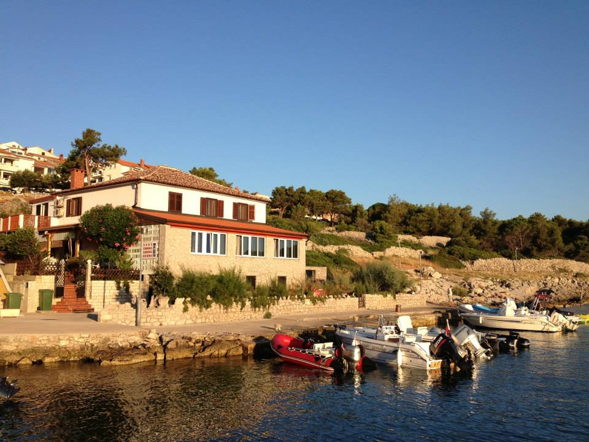

<!DOCTYPE html>
<html lang="en">
<head>
    <meta charset="utf-8">
    <meta name="viewport" content="width=device-width, initial-scale=1, shrink-to-fit=no">

    <title>Villa Galija - Mali Lošinj</title>

    <link href="https://fonts.googleapis.com/css2?family=Open+Sans:ital,wght@0,400;0,600;0,700;1,400&display=swap" rel="stylesheet">
    <link href="css/bootstrap.min.css" rel="stylesheet">
    <link href="css/fontawesome-all.min.css" rel="stylesheet">
    <link href="css/swiper.css" rel="stylesheet">
	<link href="css/styles.css" rel="stylesheet">
	

    <link rel="icon" href="images/favicon.png">
</head>
<body>
    

    <nav id="navbar" class="navbar navbar-expand-lg fixed-top navbar-light" aria-label="Main navigation">
        

  
             

       
            <button class="navbar-toggler p-0 border-0" type="button" id="navbarSideCollapse" aria-label="Toggle navigation">
                
            </button>

            

                <ul class="navbar-nav ms-auto navbar-nav-scroll">
                    <li class="nav-item">
                        <a class="nav-link active" aria-current="page" href="#header">Home</a>
                    </li>
                    <li class="nav-item">
                        <a class="nav-link" href="#About us ">Details</a>
                    </li>
                    <li class="nav-item">
                        <a class="nav-link" href="#services">Services</a>
                    </li>
                    <li class="nav-item">
                        <a class="nav-link" href="#projects">Projects</a>
                    </li>
                    <li class="nav-item">
                        <a class="nav-link" href="losinj.html">Explore Lošinj</a>
                    </li>
                </ul>
                
                    <a class="btn-outline-sm" href="#contact">Contact us</a>
                
            
 
        
 
    </nav>
      
    <header id="header" class="header">
        

            

                

                    

                        <h1 class="h1-large">Villa Galija</h1>
                        
Do you want to feel like at home? Do you wish the seagulls to wake you up? Are you in a mood for relaxed vacation? You're on right address!

                        
Enjoy a view of dolphins dancing in a school while a griffon vulture guards the sky, wall geckos happily crawl across house walls, and the best shrimp in the world plays the beat with its claws somewhere deep down in the sea…

                        <a class="btn-solid-lg" href="#introduction">More details</a>
                        <a class="btn-outline-lg" href="#contact">Contact us</a>
                    

                

                

                    

                        
                    
 
                
 
            
 
        
 
    </header> 

    

        

            

                

                    <h4>If you like an active holiday, Lošinj is the perfect place for you! Tennis, biking, hiking, jogging, diving, game fishing.</h4>
                    <a class="btn-solid-lg" href="#contact">Ask us something!</a>
                
 
            
 
        
 
    
 

    

        

            

                

                    

                        

                            <a href="https://www.airbnb.com/rooms/37508622?guests=1&amp;adults=1&amp;s=66&amp;unique_share_id=423b7d10-517b-4244-a69e-74ad62d87468&amp;source=embed_widget">View On Airbnb</a>
                            <a href="https://www.airbnb.com/rooms/37508622?guests=1&amp;adults=1&amp;s=66&amp;unique_share_id=423b7d10-517b-4244-a69e-74ad62d87468&amp;source=embed_widget" rel="nofollow">Villa Galija Mali Lošinj</a>
                            

                    
 
                
 

                
                

                    

                        <h2>Who are we?</h2>
                        <ul class="list-unstyled li-space-lg">
                            <li class="d-flex">
                                <i class="fas fa-square"></i>
                                
We are family Skender Lovrić - Marijana & Andrija.

                            </li>
                            <li class="d-flex">
                                <i class="fas fa-square"></i>
                                
We have been renting rooms for several decades. Guests who faithfully return year after year tell us that we have succeeded in that.

                            </li>
                            <li class="d-flex">
                                <i class="fas fa-square"></i>
                                
​You are welcome to be our guests as well. You only have to call and book your vacation! We're already looking forward to it!

                            </li>
                        
                        </ul>
                        <a class="btn-solid-reg" href="article.html">Contact us</a>
                    
 
                
 
            

        

    
 
   

    

        

            

                

                    

                        <h2> What we offer</h2>
                        
You will feel like home, since this is ours. We have everything you need.

                    
 
                

                

                    

                 
                        

                            

                                
                            

                            

                                <h5 class="card-title">Free WiFi</h5>
                            

                        

       
                        

                            

                                
                            

                            

                                <h5 class="card-title">Refrigerator</h5>
                            

                        

                       
                        

                            

                                
                            

                            

                                <h5 class="card-title">Waterfront
                                </h5>
                            

                        

                      
                        

                            

                                
                            

                            

                                <h5 class="card-title">Breakfast</h5>
                            

                        

                      
                        

                            

                                
                            

                            

                                <h5 class="card-title">Included essentials</h5>
                            

                        

                    
                        

                            

                                
                            

                            

                                <h5 class="card-title">Smoking allowed</h5>
                            

                        

                    

                    
 
                
 
            
 
        
 
    

  

    

        

            

                

                    

                        <h2>Lošinj - Island of Vitality</h2>
                        
High quality seas and supreme air quality with over 200 days of sunshine and 1018 plant species, of which 939 belong to indigenous flora, make Lošinj the ideal aromatherapy centre and a modern destination of vitality, health tourism and environmental awareness. 

                        <a class="btn-solid-reg" href="losinj.html">Find out more!</a>
                    
 
                

                

                    
                        <iframe src="https://www.facebook.com/plugins/video.php?height=314&href=https%3A%2F%2Fwww.facebook.com%2Fvisitlosinj%2Fvideos%2F3604344909586502%2F&show_text=false&width=560&t=0" width="560" height="314" style="border:none;overflow:hidden" scrolling="no" frameborder="0" allowfullscreen="true" allow="autoplay; clipboard-write; encrypted-media; picture-in-picture; web-share" allowFullScreen="true"></iframe>
                    
                
 
            

        
 
    
 
   

   

    

        
        

            

                

                
                    

                        

                            

                                
                               
                                

                                    
“Perfect vacations with perfect service in a perfect location ! 
                                        Everybody is super friendly also to kids . Thank you!"

                                    
Phillipp Ain

                                
 
        
                                

                                    
“Very hospitable owners, incredibly beautiful location, right on the small port of Sveti Martin, come there every year ❤ ”

                                    
Claudia Nitsche

                                

        
                                

                                    
“very familiar atmosphere clean rooms and from the window I can see the sea for 12 years pure relaxation.”

                                    
Gertrude Mehler

                                
 
        
                            
 
        
                            

                            

                         
                        
 
                    
 

                

            
 
        
 
    

    

        

            

                

                    

                        

                            <a href="https://www.airbnb.com/rooms/37508622?guests=1&amp;adults=1&amp;s=66&amp;unique_share_id=423b7d10-517b-4244-a69e-74ad62d87468&amp;source=embed_widget">View On Airbnb</a>
                            <a href="https://www.airbnb.com/rooms/37508622?guests=1&amp;adults=1&amp;s=66&amp;unique_share_id=423b7d10-517b-4244-a69e-74ad62d87468&amp;source=embed_widget" rel="nofollow">Villa Galija Mali Lošinj</a>
                            

                    
 
                
 
                

                    

                        <h2>Feel free to call, send a fax or e-mail. We will respond as soon as possible.</h2>

                        <form>
                            

                                <input type="text" class="form-control-input" placeholder="Name" required>
                            

                            

                                <input type="email" class="form-control-input" placeholder="Email" required>
                            

                            

                                <textarea class="form-control-textarea" placeholder="Message" required></textarea>
                            

                            

                                <button type="submit" class="form-control-submit-button">Submit</button>
                            

                        </form>
                      
                    
 
                

            
 
        
 
    
 

    

        

            

                

                    

                        <h6>Contact</h6>
                        <ul class="list-unstyled li-space-lg p-small">
                            <li>Sveti Martin 61</li>
                            <li>Mali Lošinj, 51550</li>
                            <li>Croatia</li>
                            <li><a href="mailto:villagalija@gmail.com">villagalija@gmail.com</a></li>
                            <li>Tel: +385-51-231-187</li>
                            <li>Fax: +385-51-233-799</li>
                        </ul>

                    

                    

                        
                            <a href="https://www.facebook.com/vilagalija">
                                <i class="fas fa-circle fa-stack-2x"></i>
                                <i class="fab fa-facebook-f fa-stack-1x"></i>
                            </a>
                        

                        
                            <a href="https://www.facebook.com/vilagalija">
                                <i class="fas fa-circle fa-stack-2x"></i>
                                <i class="fab fa-airbnb fa-stack-1x"></i>
                            </a>
                        
                        
We would love to hear from you <a href="mailto:villagalija@gmail.com"><strong>villagalija@gmail.com</strong></a>

                    
 
                
 
            
 
        
 
    
 

   
    

        

            

                

                    
Copyright © <a href="https://github.com/senseji/">Robert Lovrić</a>

                
 
            
 
        
 
    
 
    

  
    <button onclick="topFunction()" id="myBtn">
        
    </button>
  
     
     
     
</body>
</html>
